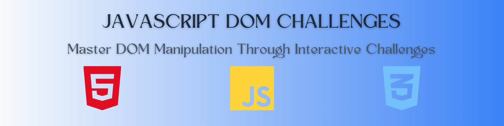
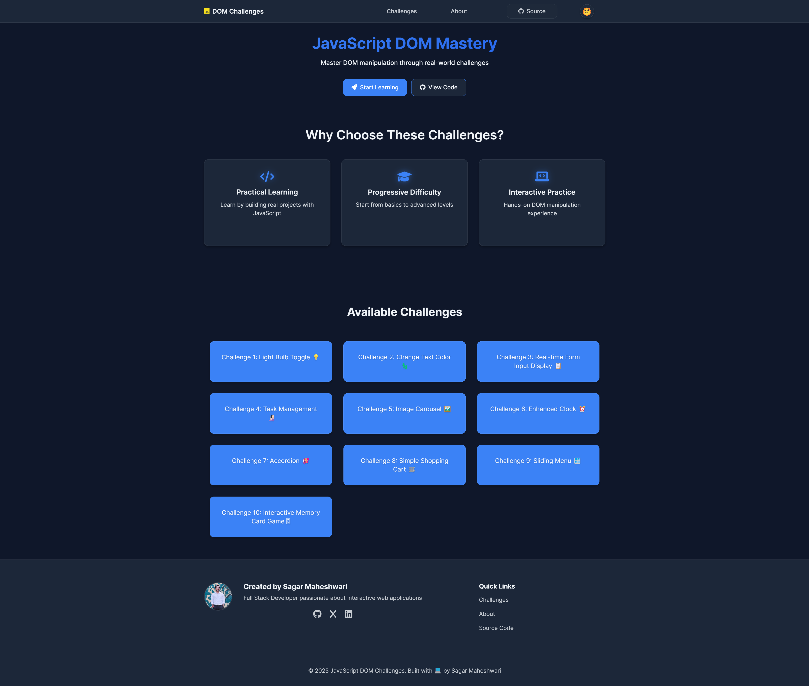

# 🚀 JavaScript DOM Challenges

A comprehensive collection of interactive DOM manipulation challenges designed to help developers master JavaScript DOM operations through hands-on practice.



[](https://sagar-1m.github.io/JavaScript-DOM-Challenges/)
[](https://github.com/sagar-1m/JavaScript-DOM-Challenges/commits/main)
[](https://opensource.org/licenses/MIT)

## 📋 Overview

This project contains 10 progressive challenges focused on DOM manipulation techniques using vanilla JavaScript. Each challenge is designed to teach specific concepts while building practical components that you might use in real-world web applications.

**[Live Demo](https://sagar-1m.github.io/JavaScript-DOM-Challenges/)** | **[Source Code](https://github.com/sagar-1m/JavaScript-DOM-Challenges)**



## 🎯 Challenges

| #   | Challenge                                      | Concepts Covered                                     | Preview |
| --- | ---------------------------------------------- | ---------------------------------------------------- | ------- |
| 1   | [Light Bulb Toggle](./challenge-1/)            | Event listeners, DOM state management                | 💡      |
| 2   | [Change Text Color](./challenge-2/)            | DOM style manipulation, event handling               | 🦎      |
| 3   | [Real-time Form Input Display](./challenge-3/) | Form events, DOM updates, input handling             | 📋      |
| 4   | [Task Management](./challenge-4/)              | CRUD operations, local storage, event delegation     | 🧏🏻‍♂️      |
| 5   | [Image Carousel](./challenge-5/)               | Timers, CSS transitions, DOM traversal               | 🖼️      |
| 6   | [Enhanced Clock](./challenge-6/)               | Date object, requestAnimationFrame, SVG manipulation | ⏰      |
| 7   | [Accordion](./challenge-7/)                    | DOM traversal, animations, event handling            | 🪗      |
| 8   | [Simple Shopping Cart](./challenge-8/)         | State management, event delegation, DOM updates      | 🛒      |
| 9   | [Sliding Menu](./challenge-9/)                 | CSS transitions, event handling, accessibility       | 🪟      |
| 10  | [Memory Card Game](./challenge-10/)            | Array manipulation, DOM creation, game logic         | 🂫       |

## 🌟 Key Features

- **Progressive Difficulty**: Start with simple challenges and advance to more complex ones
- **Real-world Components**: Build UI components used in modern web applications
- **Vanilla JavaScript**: No frameworks or libraries - pure DOM manipulation
- **Responsive Design**: All challenges work across different screen sizes
- **Accessibility Features**: Focus states, keyboard navigation, and ARIA attributes
- **Dark Mode Support**: Light and dark theme options

## 📚 Learning Outcomes

- DOM selection and traversal techniques
- Event handling and delegation
- Dynamic content creation and manipulation
- State management in vanilla JavaScript
- UI component development
- Responsive design implementation
- Accessibility best practices

## 🛠️ Technologies

<div style="display: flex; gap: 10px;">
  
  
  
</div>

## 💻 Getting Started

### Prerequisites

- A modern web browser (Chrome, Firefox, Safari, or Edge)
- Basic knowledge of HTML, CSS, and JavaScript
- Code editor (VS Code, Sublime Text, etc.)

### Installation

1. Clone the repository:

   ```bash
   git clone https://github.com/sagar-1m/JavaScript-DOM-Challenges.git
   ```

2. Navigate to the project directory:

   ```bash
   cd JavaScript-DOM-Challenges
   ```

3. Open the landing page to navigate through challenges:
   ```bash
   open index.html  # On macOS
   # Or simply double-click index.html in your file explorer
   ```

### Challenge Structure

Each challenge follows this structure:

```
challenge-X/
├── index.html      # HTML structure
├── styles.css      # Challenge-specific styling
├── script.js       # JavaScript implementation
```

## 🤝 Contributing

Contributions are welcome! Here's how you can contribute:

1. Fork the repository
2. Create your feature branch: `git checkout -b feature/new-challenge`
3. Add your challenge following the project structure
4. Commit your changes: `git commit -m 'Add new challenge: Name'`
5. Push to the branch: `git push origin feature/new-challenge`
6. Open a Pull Request

Please ensure your code follows the project's style and includes appropriate documentation.

## 📄 License

This project is licensed under the MIT License - see the [LICENSE](LICENSE) file for details.

## 🙏 Acknowledgments

- [Font Awesome](https://fontawesome.com/) for the icons
- [Inter Font](https://fonts.google.com/specimen/Inter) for typography
- [Hitesh Choudhary](https://x.com/hiteshchoudhary) and [Piyush Garg](https://x.com/piyushgarg_dev) for their easy learning approach towards a complex topic
- All contributors and users of this learning resource

---

<div align="center">
  <p>Created with 💻 by Sagar Maheshwari</p>
  
  <p>
    <a href="https://github.com/sagar-1m">
      
    </a>
    <a href="https://linkedin.com/in/sagar-maheshwari-1m">
      
    </a>
    <a href="https://x.com/maheshwarisaga4">
      
    </a>
  </p>
</div>
